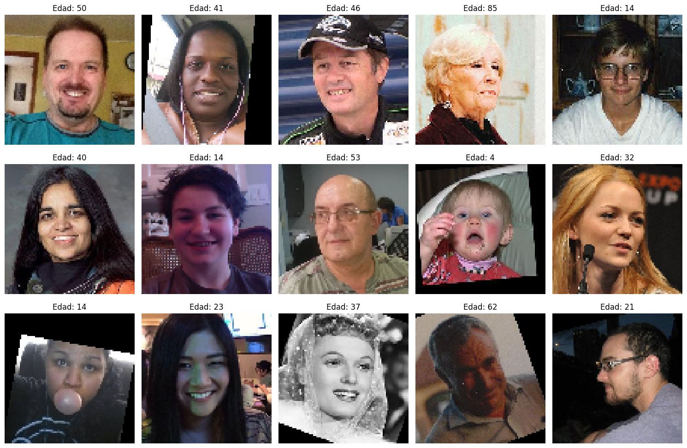
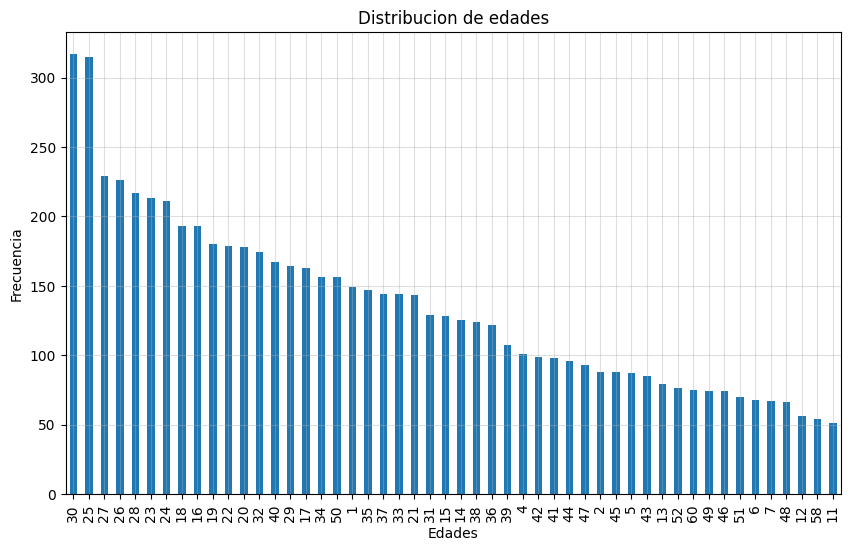

## Descripción del proyecto 
 A la cadena de supermercados Good Seed le gustaría explorar si la ciencia de los datos puede ayudarle a cumplir con las leyes sobre el alcohol, al asegurarse de no vender alcohol a personas menores de edad. Es importante tener en cuenta lo siguiente:

* Las tiendas están equipadas con cámaras en el área de pago, las cuales se activan cuando una persona está comprando alcohol.
* Los métodos de visión artificial se pueden usar para determinar la edad de una persona a partir de una foto.

El objetivo del proyecto es construir y evaluar un modelo para verificar la edad de las personas, utilizando un conjunto de fotografías de personas que indican su edad.

## Objetivos del proyecto
Los pasos realizados en este proyecto son los siguientes:

* Análisis exploratorio del conjunto de datos, explorar la distribución de edad del conjunto y verificar la edad de imágenes tomadas al azar.
  
* Verificación y desarrollo de un modelo de red neuronal convolucional (CNN) que pueda identificar edades con base en imágenes y que cumpla con el objetivo de tener un error absoluto medio (MAE) menor a 8 años.

## Lenguajes y herramientas usadas

Análisis exploratorio de datos: Python, Pandas, TensorFlow/Keras, Matplotlib. 

Modelo de predicción: Redes Neuronales Convolucionales (CNN), ResNet50, optimizador Adam, analisis de capas por GlobalAveragePooling2D y Dense. 

Métricas utilizadas: Error Absoluto Medio (MEA), Error Cuadrático Medio (MSE).

## Conclusiones
En este proyecto se inicio con un analisis exploratorio de datos en los que se observo la tendencia de las edades identificadas en el grupo de imagenes del conjunto de datos, siendo el rango de edades que tiene mayor presencia entre 23 y 30 años. Se validaron las imagenes dentro del conjunto del dataset.

Posteriormente se trabajo en el modelo de prediccion de edades usando identificacion de imagenes y el modelo base ResNet, se verificó el progreso del modelo usando la métrica de MAE y para la pérdida MSE. Dentro de los resultados se obtuvieron las siguientes observaciones y mejoras:

* Reducción consistente del error de 11.47 a 7.21 años, estando por debajo del 8 solicitado como objetivo del proyecto
* El MAE de validación se mantiene cercano al de entrenamiento
* La diferencia entre entrenamiento y validación es aceptable
* El modelo alcanzó el objetivo en solo 4 épocas, empezando en la época 1 con un error y perdida altos y conforme pasaban épocas el error y pérdida fue disminuyendo hasta alcanzar el objetivo en la época 4.

 Este modelo puede servir de punto de partida al cliente como proyecto de vision artificial pero definitivamente ocupa mayor exactitud y mayor optimizacion para poder ser mas confiable y rapido. 
